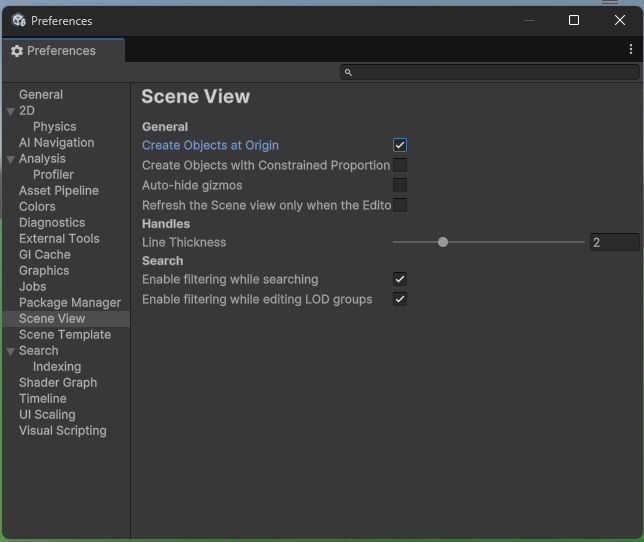
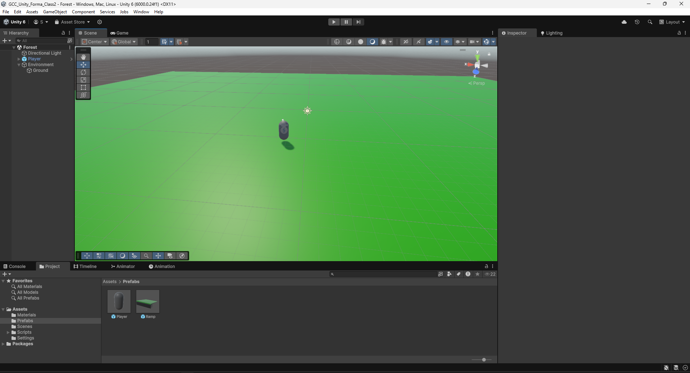
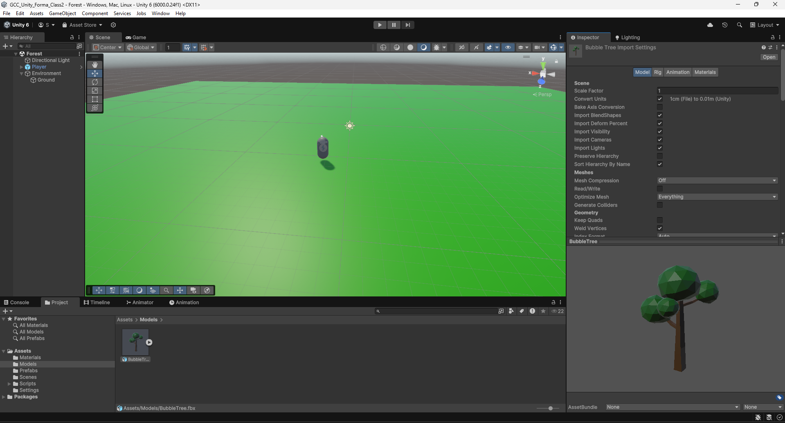
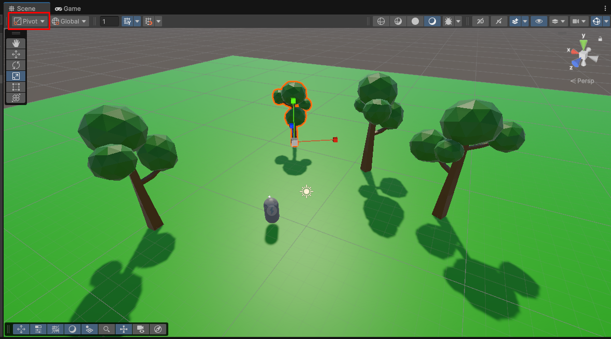
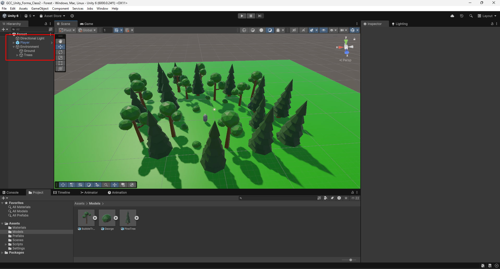
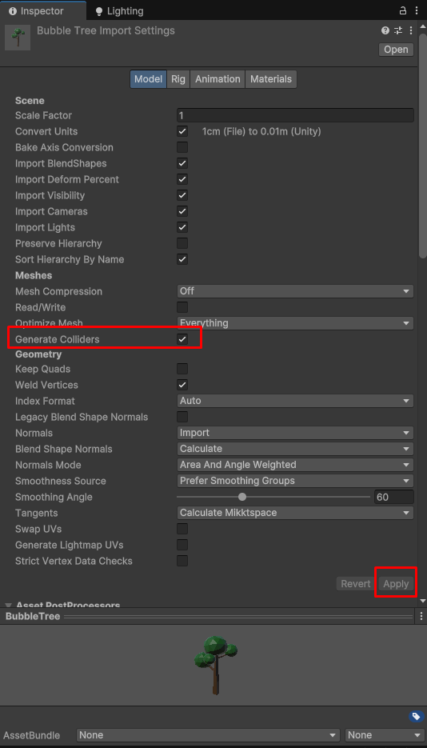
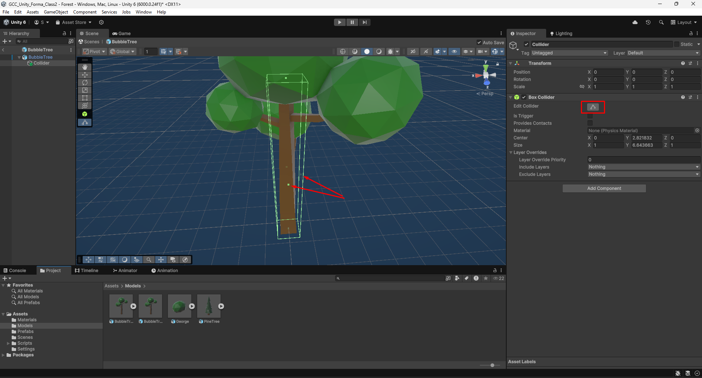
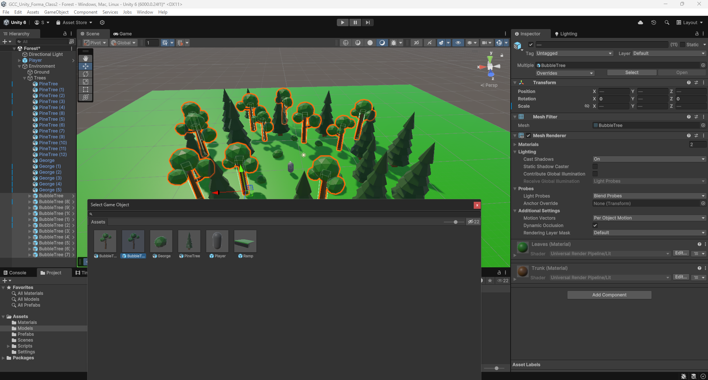
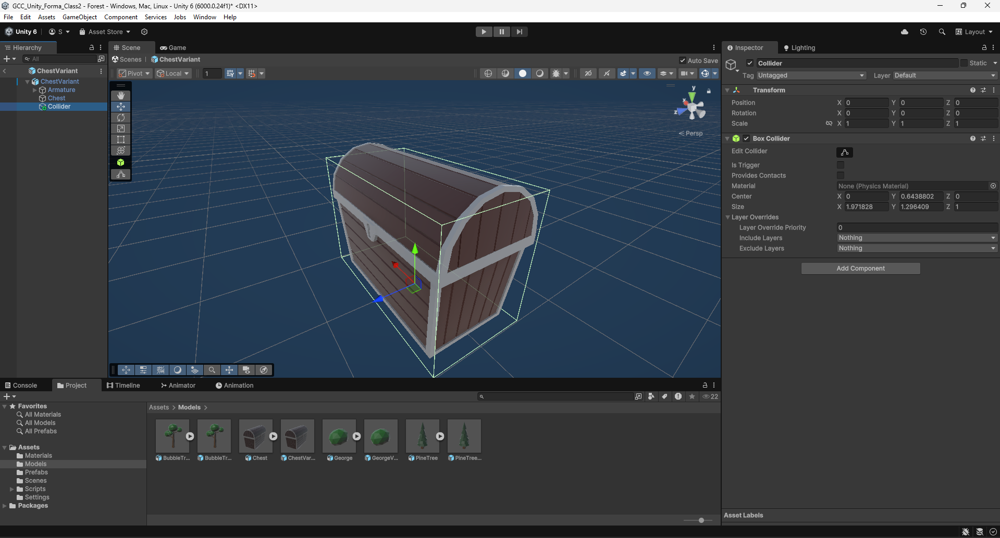

# Class 2

In this second class, you'll learn the following:
- creating a new scene
- importing and using a 3D model
- understanding more advanced physics systems (layers, raycasts)
- understanding basic animation control
- creating a simple script

## Creating a new scene

We will start from where we stopped in the first class.
If you want, you can clone the repository of the [first class](https://github.com/Skydrag42/GCC_Unity_Forma_Class1) to have the same starting point.
Open your project from the Unity Hub.
In your project window, go to the `Scenes` folder and right-click, Create->Scene->Scene.
Lets name it *forest*. Double-click the asset to open the new scene.

There should be two default objects in the scene:
- a camera
- a light source (the sun)

We will start by adding a few other elements:
- a plane to act as the ground (scale it up a notch)
- the player (don't forget to remove the previous camera)

If you want your objects to always get created with a position of (0,0,0), you can go to Edit->Preferences->Scene View
and select Create Objects at Origin.

Your scene should now look something like this:

## Importing 3D models

### Adding the trees

We will start by importing a simple lowpoly tree. 
You can find it in the [ClassTutorialAssets folder](ClassTutorialAssets/BubbleTree.fbx) under the name *BubbleTree.fbx*.
To import it, drag and drop the file into a folder of your project window (*Models* in my case).
This creates a special prefab that you can directly use in your project, but you won't be able to modify it that much.

Lets add a few trees to our scene. Rotating and scaling them creates some variety, making the scene less uniform.
If your object ends up above ground after scaling with the scene view handle, try setting the tool mode to `Pivot` instead of `Center`.
It will make the tools work from the origin (or pivot point) of your objects.

You can add the *PineTree* model and the bush (*George*) if you want to add more diversity to your scene.
Don't forget to keep your hierarchy organized or you'll have a hard time finding your objects later.

### Setting colliders

Test the scene, and try bumping into a tree. Oh, *flûte*! You go right through them.
That's because we haven't set any colliders for the objects.

To do so, we have to go to the import settings of the models. 
Select your tree asset, and in the inspector, go to the `model` tab.
If look at the *Meshes* category, you should see a setting called *Generate Colliders*.
Tick it, scroll to the bottom and press `Apply`.

Now select any of your instanciated trees, and you should see a new component `MeshCollider`. 
If you try and run the scene again now, you should not be able to pass through the tree anymore.

However, doing so has a few downsides. Since it creates a collider matching the model exactly, 
it can become quite inefficient the more objects are added. 
So unless you really the precision on your model, we will prefer another method which consists in using primitive (so simpler) colliders.

For that, lets first untick the option and apply the changes. We will now have to create a prefab variant of our model,
so that all our instances share the same properties. Select your asset, right-click, Create->Scene->Prefab Variant.
Doing so instead of directly changing the model asset will allow for modifications to the 3D model without having 
to add the colliders again every time. 

Enter prefab mode for the newly created prefab.
You now have to options. Either you add the colliders as components of the root object, 
or you add them as children. I'll go for the second option. 
Since the model is quite simple, I'll only add one box collider to act as the trunk.
You can click on the `Edit Collider` button to edit the shape of the collider directly from the scene view
(hover over the button for tooltip).

Save your prefab, exit prefab mode, and try your scene. 
Mmh... It does not work. Try to guess why. 

The problem is that we are still using the old prefab in our scene. 
Thankfully for us, if you right-click on a tree in your hierarchy, you'll see under Prefab an option called `Replace...`.
Right under is an option called `Replace and keep overrides...`. Use it (if available) 
to prevent resetting the position and other changes. Select your new prefab and you should be good! 
Don't forget to change all your instances (select them all to do it all at once).

And we're all good with our trees!

### Importing a chest

Now that you know how it works, do the same for the *Chest* model. Don't forget to add the collider.
If you did it correctly, it should look like this:

## A bit of scripting

*course by Julien Charvet for GCC*