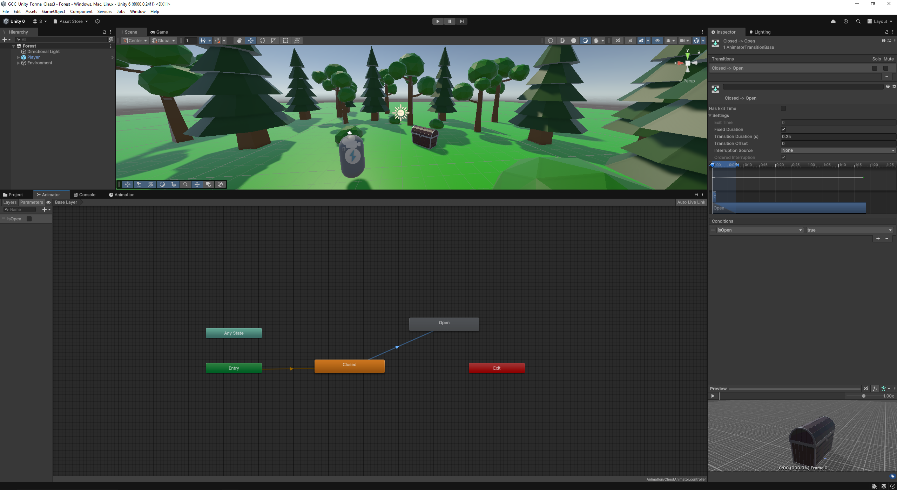

# Class 3

In this third class, you'll learn the following:
- Creating a basic animator controller
- Making a User Interface (UI)
- Using a scriptable object to store data
- Switching scenes
- Building the project

## Animating the chest

Like last time, you can get the current project from the repository of the previous class. 
We left off at the chest interaction. However, we are only printing out a simple message in the console window.
We want to see our chest open when we interact with it. For that, we will need to animate it.
The chest already comes with an opening animation, you can preview it by clicking the arrow on the chest asset 
and selecting the *Armature|Chest_open* Animation Clip. A little preview should appear at the bottom of your inspector.


### The Animator Controller

Go to your chest prefab and add an `Animator` component to the root object. 
Only one of the settings will be important here, and that is the Runtime Animator Controller.
So let's start by creating a new RuntimeAnimatorController asset (Create->Animation->Animator Controller).
I'll name it *ChestAnimator*. You can already drop it in the animator slot of the chest component.

Then, double click on the asset to enter the Animator window. It should look like this:


An animator in Unity is also called a state machine. 
It means that you can define a specific behaviour for different states, and add transitions between those states.
We'll need two states:
- closed
- open

To make a new state, right-click, Create State->Empty. Create the two states. 
One of them should be orange and linked to the `entry` state, while the other is gray and alone.
The orange one should be `closed`, as we want our chest to start closed and then open it.
If you did it the other way around, either rename them or right-click on the grey one, Set as Layer Default State.
Then, in the inspector, assign the correct animations to each state (click on the dot at the end of the `Motion` field).

If you try your scene, nothing should have changed, but if you set the `open` state as the default state, the chest should open itself when starting the scene.

### Adding transitions

to switch from one state to another, we need to create transitions. Right-click on the `closed` state, Make Transition. 
Then click on the other state to link it. Select the transition to open its inspector. 
A little preview is available at the bottom. Everything looks fine, but if we try it right now, the chest will immediately switch to the open state
(actually, the two states will be mixed during 0.25s before the transition ends).

Take a look at the settings. 


- The first one, `Has Exit Time` (and its respective value under the settings dropdown), 
is used to tell how long you want the original state to be active for before the transition occurs. 
This can be helpful when linking chained animations, but we don't want it here. Just untick the box (and the value field should get grayed out, along with a warning).
- Then, we have the `Fixed Duration` one. It defines if the transition duration is in seconds or percents, and you can set the value right under.
- Skipping the Interruption settings, we have the `Conditions` list. They define when the transition can be triggered. 

Since we did not use any Exit Time, the animator does not know when to trigger the transition. To add a condition, we first need some values to check.
On the left of the Animator window, under the `Parameters` tab, add a new `Bool` (a `Trigger` could also work very well) named *isOpen*.
then in the Conditions list, add a new one for when `isOpen` is true.



Press Play, select your chest to get the animator realtime preview, then in the animator window click on the `isOpen` tickbox to set it to true. 
The animation should trigger. All that's left for us is to set it to true when we interact with the chest.

### Linking with the chest script

In your chest script, add a reference to the animator and call the `SetBool()` method when interacting.

```cs
public class Chest : MonoBehaviour, IInteractable
{
	public Animator animator;

	public void Interact()
	{
		animator.SetBool("isOpen", true);
	}

}
```

Try your scene (don't forget to link the animator reference in your prefab), *et voilà*!

## Adding a UI pop up

---
*course by Julien Charvet for GCC*

[previous class](https://github.com/Skydrag42/GCC_Unity_Forma_Class2/Class2.md)
||
[next class](https://github.com/Skydrag42/GCC_Unity_Forma_Class4/Class4.md)